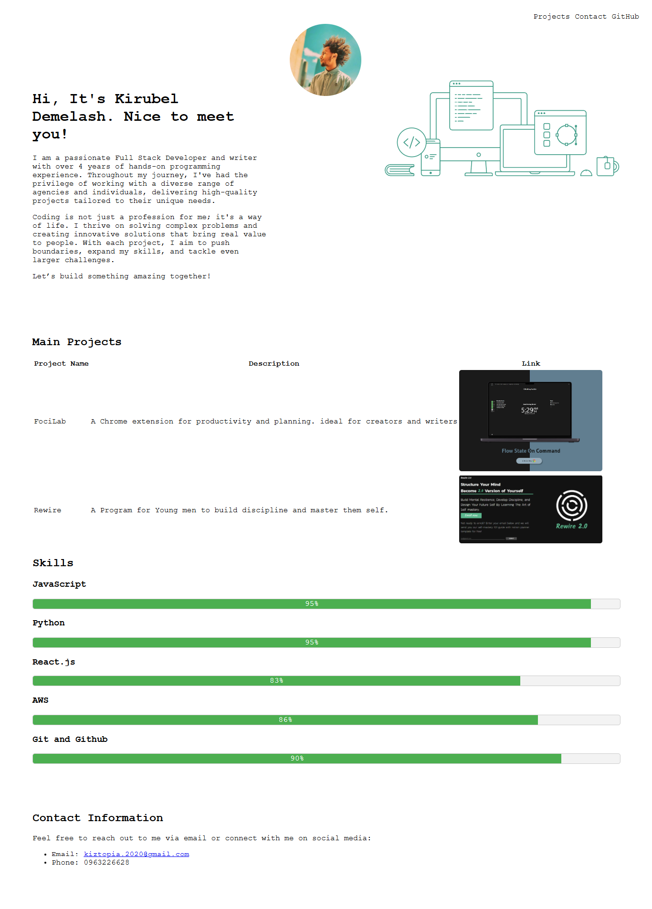
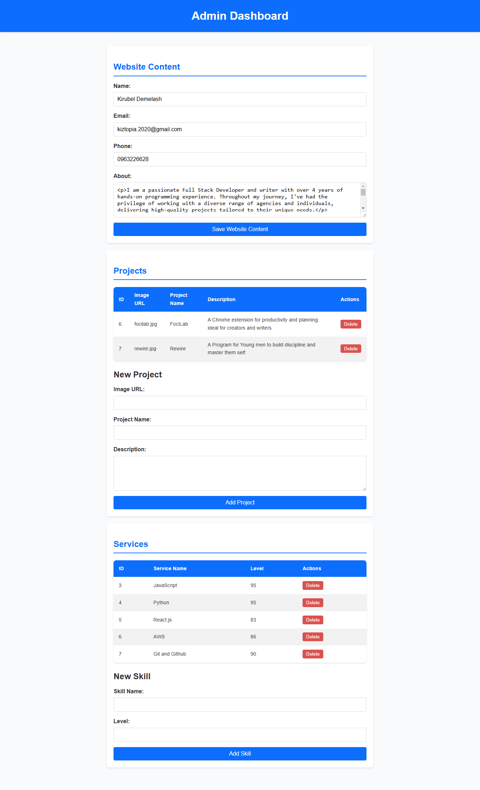

## Simple Portfolio Using MVC Architecture

---

### Screenshots

#### Main Page

#### Admin Page

---

### Introduction

This project demonstrates a simple portfolio application built using the **MVC (Model-View-Controller)** architectural pattern. It serves as an example of how modular and maintainable PHP applications can be developed while integrating database-driven content.

---

### Features

- Modular and well-structured code using the MVC pattern.
- Dynamic rendering of portfolio sections, projects, and services.
- Authentication for users and admins.
- Responsive design using custom CSS for an optimal user experience.
- Integration with a relational database for content management.

---

### Database Structure

The application uses the following database schema:

- **`admins`**  
  Stores admin usernames and hashed passwords for backend authentication.

- **`users`**  
  Holds user credentials for frontend interaction.

- **`portfolio`**  
  Contains information about portfolio sections.

- **`project`**  
  Stores details about projects such as name, image, and description.

- **`services`**  
  Lists available services and their corresponding skill levels.

- **`sections`**  
  Defines sections for content organization.

- **`website`**  
  Stores general website metadata like name, email, and contact details.

---

### MVC Design

The project adheres to the following MVC principles:

- **Model**  
  Manages data logic and database interactions.

- **View**  
  Handles the presentation of data and user interface.

- **Controller**  
  Processes user inputs and updates the model or view accordingly.

---

### File Structure

1. **Model Class (`model.class.php`)**  
   Interacts with the database and retrieves application data.
2. **View Class (`view.class.php`)**  
   Renders dynamic pages using data fetched from the model.
3. **Controller Class (`controler.class.php`)**  
   Manages application logic and mediates between the model and view.
4. **Frontend**  
   Styled using `style.css` and organized with reusable components.

---

### How to Run

1. Import the provided SQL file into your database.
2. Update the database connection settings in the configuration file.
3. Host the project on a local server (e.g., XAMPP).
4. Access the application via the browser.

---

### Technologies Used

- **PHP**: Backend development and MVC implementation.
- **MySQL**: Relational database management.
- **HTML/CSS**: Frontend structure and styling.

---

### Future Improvements

- Implementing AJAX for a more dynamic user experience.
- Adding a CMS-like interface for easier portfolio management.
- Enhancing security measures like prepared statements for SQL queries.

---

Feel free to expand or adapt this project for your personal portfolio!
